# [Introduction to SQL](https://sqlbolt.com/lesson/introduction)

As I'm understanding it, SQL isn't strictly 'programming'. It feels more like data manipulation. It's kinda wild we have entire language that's built around making queries and it's still considered not powerful or robust enough for some queries.

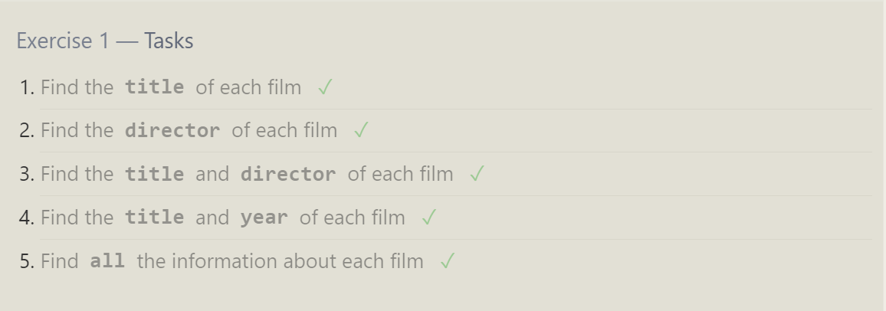
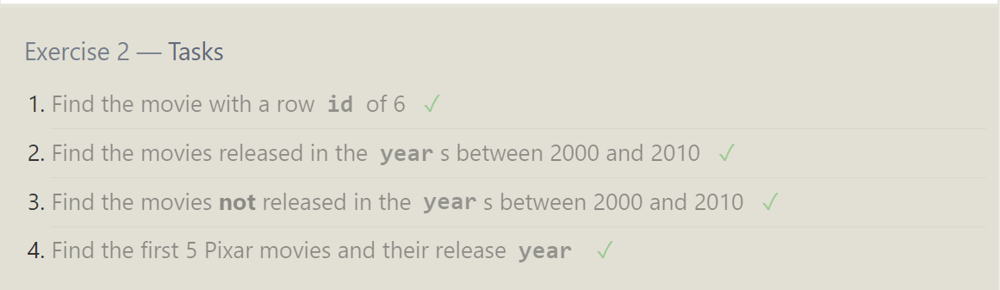
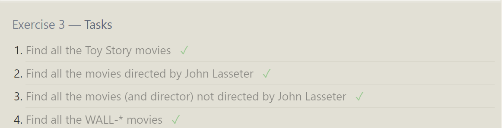

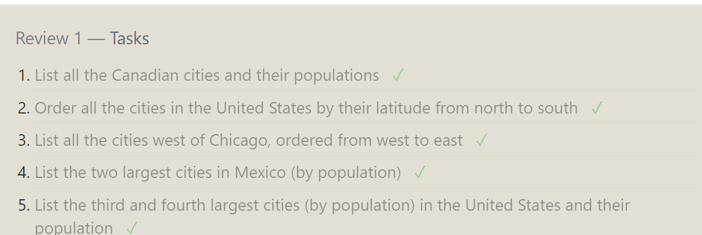
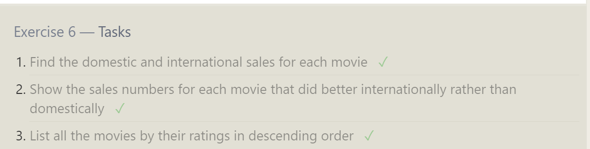
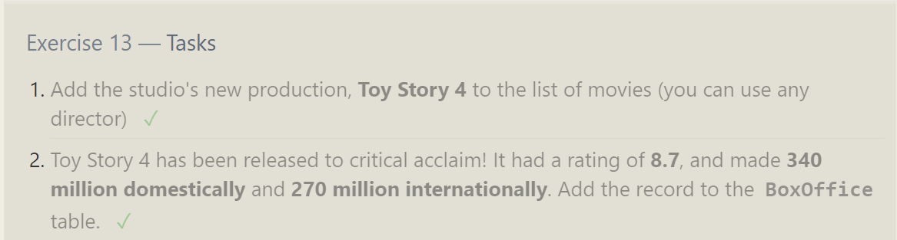
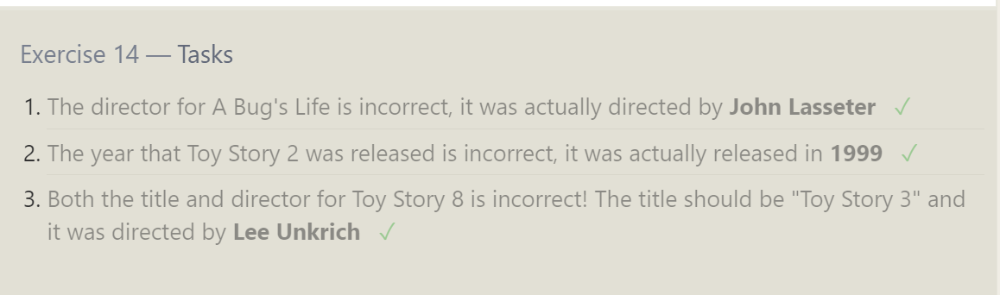
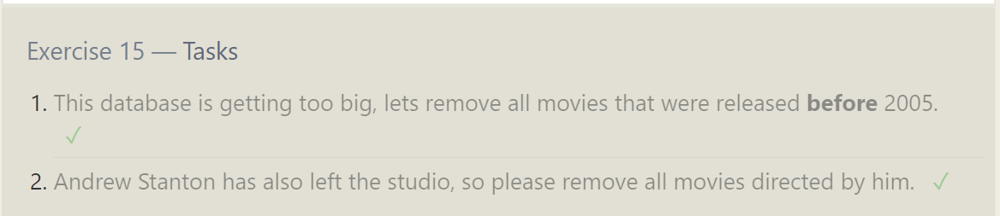
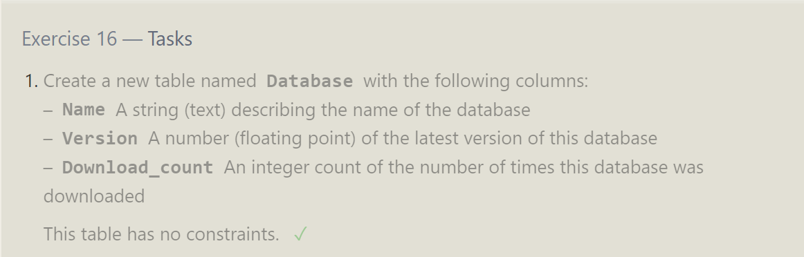
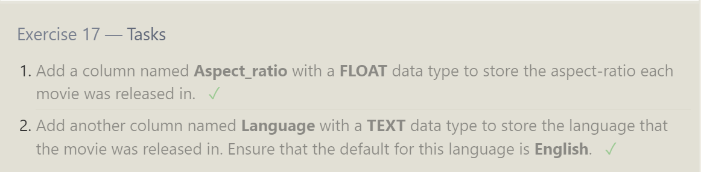
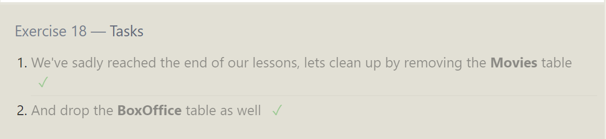
