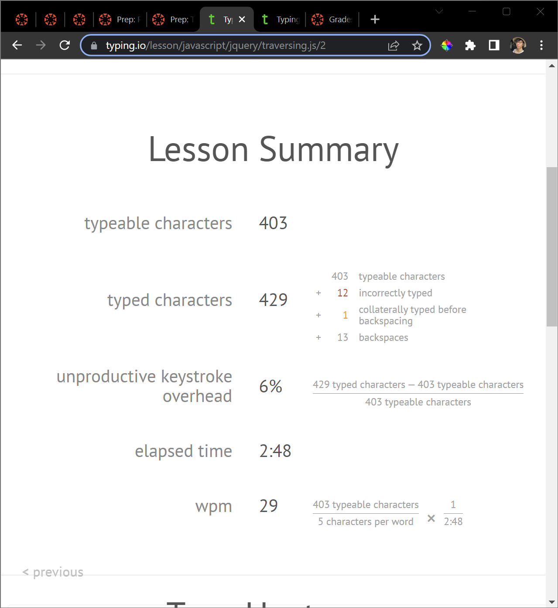
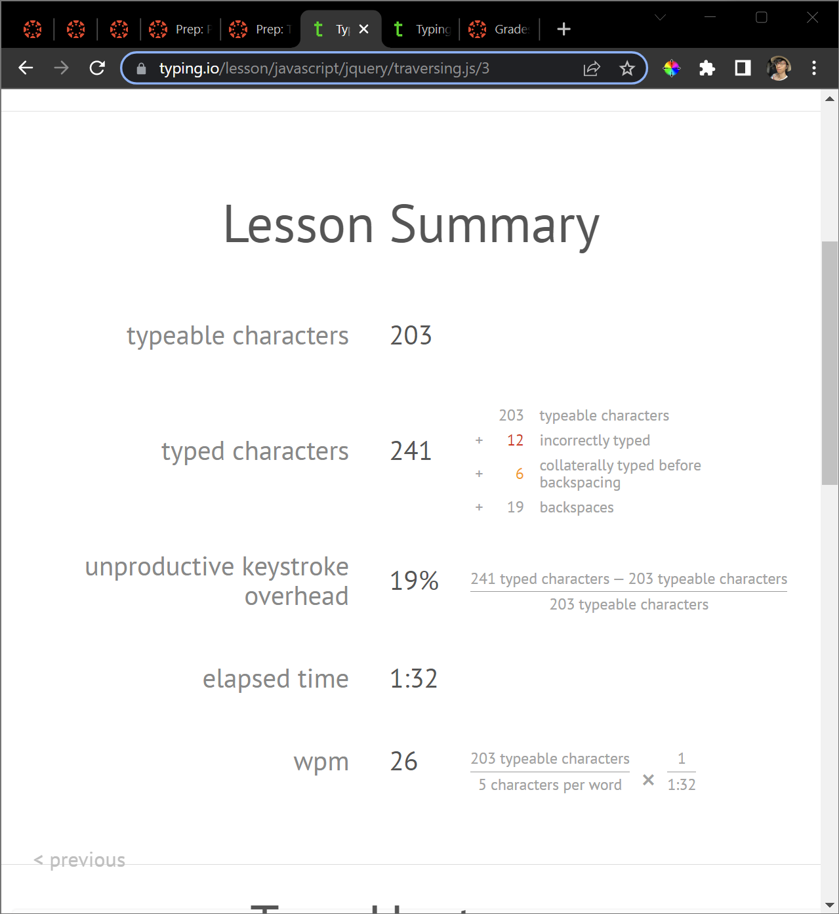
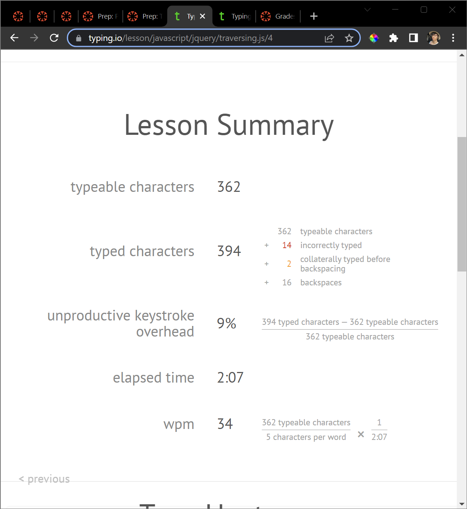
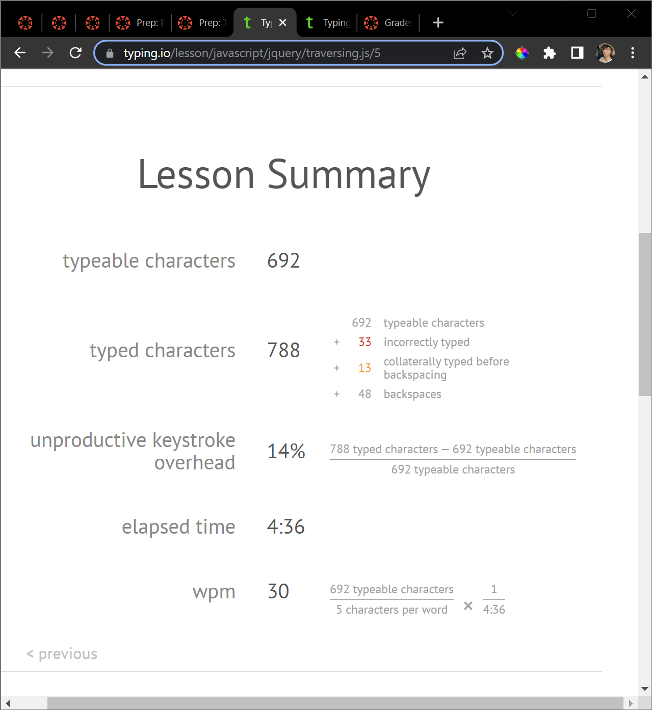
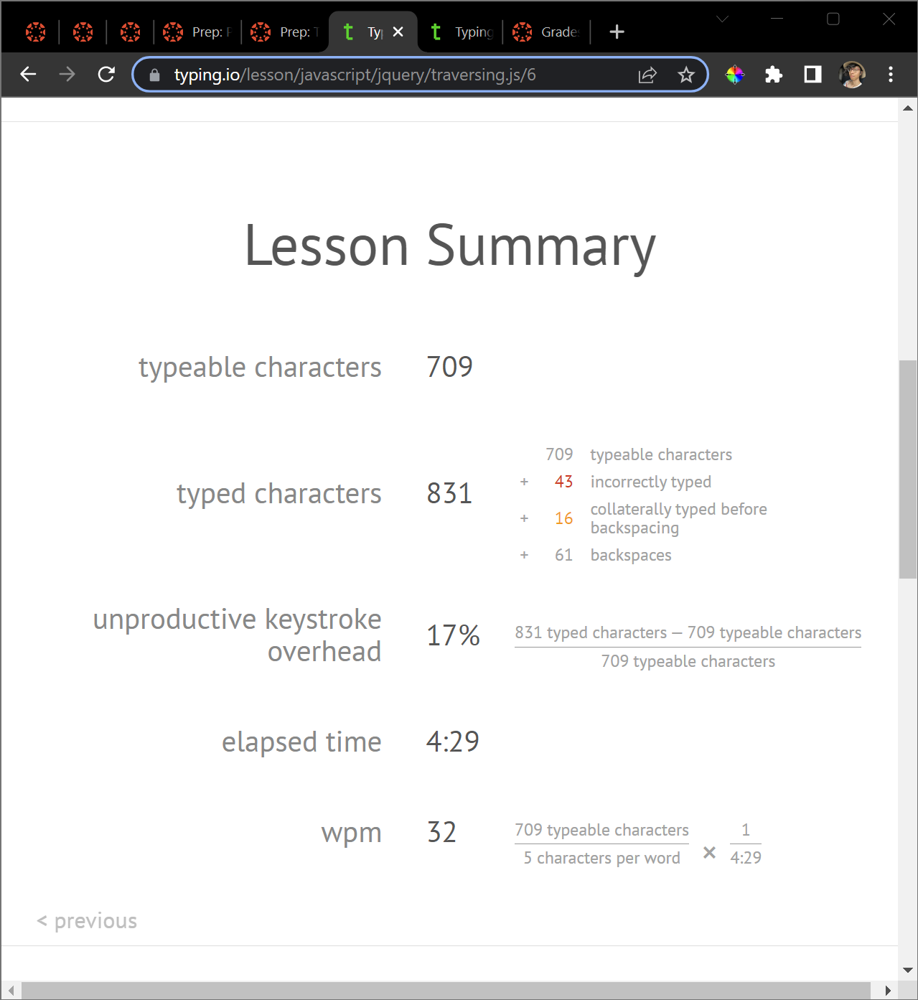

# Typing Practice

## Tasks

[Typing Practice](https://typing.io/lessons)

1. Choose the language of your upcoming 401.

2. Complete at least 50% of the lessons.
  - But we recommend that you keep on going!

3. Take a screenshot of each lesson summary that you complete.

### Screenshots

jQuery JavaScript

### Thoughts

Wow! I was soooo annoyed at first. I immediately wanted to look for was to automate the typing. I quickly settled on actually doing the typing and had a hard time keeping my mind focused on the page. I was beating myself up for how 'slow' I felt like I was going and how fast I wondered how 'real' programmers typed on this exercise and how my peers did.

As I moved from practice to practice, I noticed my confidence and speed with typing did actually improve, especially with characters that I don't usually use when coding. I'm glad the app has metrics to display upon completion of each exercise, so I knew I wasn't just psyching myself out :)
